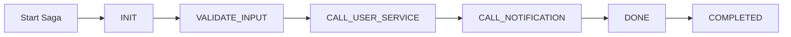
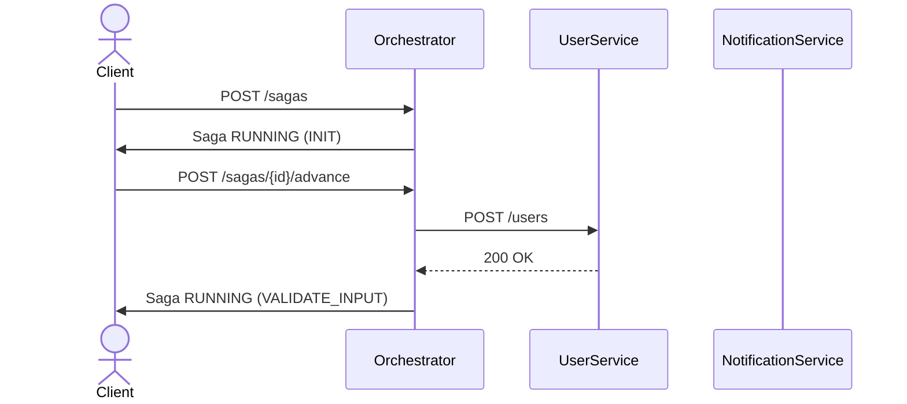
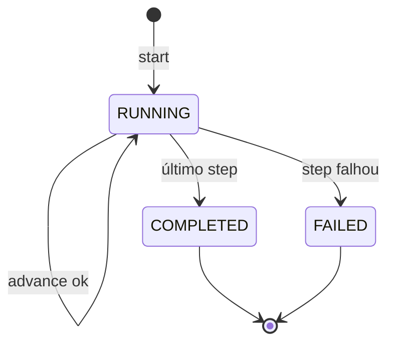

# ⚽ NoteSoccer – Orchestration Service
Serviço responsável por **orquestrar fluxos de Saga** no projeto NoteSoccer.  
Atualmente suporta:

- `USER_ONBOARDING`
---
## 🚀 Executando localmente

### Pré-requisitos
- Java 21
- Maven 3.9+
- PostgreSQL 17 (schema `orchestration_service`)

### Rodando o projeto
```bash
mvn spring-boot:run
```
A API ficará disponível em:
http://localhost:8080/api/v1/sagas

📡 Endpoints principais ([Collection do Postman](orchestration-service/src/docs/OrchestrationService.postman_collection.json))
1️⃣ Criar Saga
```http
POST /api/v1/sagas
```
Body (exemplo USER_ONBOARDING):
```json
{
  "type": "USER_ONBOARDING",
  "payload": {
    "userId": "u-123"
  }
}
```
Response
```json
{
  "id": "a9078ab2-5cb9-463b-b4a4-202fd018be10",
  "type": "USER_ONBOARDING",
  "status": "RUNNING",
  "currentStep": "INIT",
  "data": {
    "userId": "u-123"
  },
  "createdAt": "2025-09-04T19:54:33.447672Z",
  "updatedAt": "2025-09-04T19:54:33.447672Z"
}
```

2️⃣ Avançar Saga
```http
POST /api/v1/sagas/{id}/advance
```
Response (quando há próximo step):
```json
{
  "id": "a9078ab2-5cb9-463b-b4a4-202fd018be10",
  "type": "USER_ONBOARDING",
  "status": "RUNNING",
  "currentStep": "VALIDATE_INPUT",
  "data": {
    "userId": "u-123"
  },
  "createdAt": "...",
  "updatedAt": "..."
}
```
Response (quando último step concluído):
```json
{
"id": "...",
"type": "USER_ONBOARDING",
"status": "COMPLETED",
"currentStep": "DONE",
"data": {
"userId": "u-123"
},
"createdAt": "...",
"updatedAt": "..."
}
```

3️⃣ Consultar Status
```http
GET /api/v1/sagas/{id}
```
Response
```json
{
  "id": "...",
  "type": "USER_ONBOARDING",
  "status": "RUNNING",
  "currentStep": "CALL_USER_SERVICE",
  "data": {
    "userId": "u-123"
  },
  "createdAt": "...",
  "updatedAt": "..."
}
```

🧩 Definições de Saga
As Sagas são configuradas em [SagaDefinitions](src/main/java/com/squadprisma/notesoccer/orchestration_service/domain/definitions/SagaDefinitions.java)
Exemplo: USER_ONBOARDING

```html
List.of(
        SagaStep.INIT,
        SagaStep.VALIDATE_INPUT,
        SagaStep.CALL_USER_SERVICE,
        SagaStep.CALL_NOTIFICATION,
        SagaStep.DONE
        );
```

Helpers disponíveis:
- firstStep(type)
- nextStep(type, stepName)
- isLast(type, stepName)
- goToLast(type)

📊 Diagramas


Sequência com Serviços


Estados


🧪 Testes
Unitários

Localizados em:
- src/test/java/com/squadprisma/notesoccer/orchestration_service/application/service/SagaManagerTest.java

Rodar testes
```bash
mvn test
```

📂 Estrutura do projeto
```swift
orchestration-service/
 ├── src/main/java/com/squadprisma/notesoccer/orchestration_service
 │   ├── api/ (controllers, DTOs, exceptions)
 │   ├── application/service (SagaManager)
 │   ├── domain/ (definitions, entity, enums, ports)
 │   ├── infra/ (dispatcher, clients)
 │   └── repository/
 ├── src/test/java/... (unit tests)
 ├── resources/
 └── docs/ (diagramas e documentação)
```